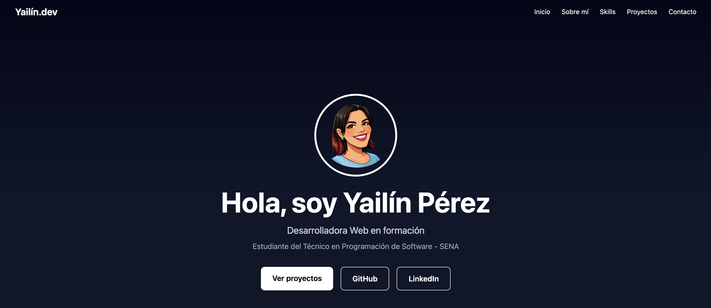

# 💎 Portfolio Web Profesional

Portafolio personal donde presento mis proyectos, tecnologías y habilidades como desarrolladora web.

🌐 **Sitio web:**  
https://yailinpvdev.github.io/portfolio/

---

## 🚀 Tecnologías utilizadas

- React
- Vite
- Tailwind CSS
- JavaScript
- Git
- GitHub

---

## 📂 Características

- Diseño moderno y responsive
- Sección de presentación personal
- Proyectos destacados
- Enlaces a GitHub y LinkedIn
- Deploy con GitHub Pages

---

## 📸 Vista del proyecto

---

## 🔗 Enlaces

💻 Repositorio  
https://github.com/yailinpvdev/portfolio

👩‍💻 GitHub  
https://github.com/yailinpvdev

🔗 LinkedIn  
https://linkedin.com/in/yailin-perezv

---

## 📌 Sobre mí

Soy estudiante de **Programación de Software** y estoy desarrollando proyectos para fortalecer mis habilidades en desarrollo web moderno, consumo de APIs y construcción de interfaces.

Este portafolio reúne algunos de los proyectos que he construido durante mi proceso de aprendizaje.
